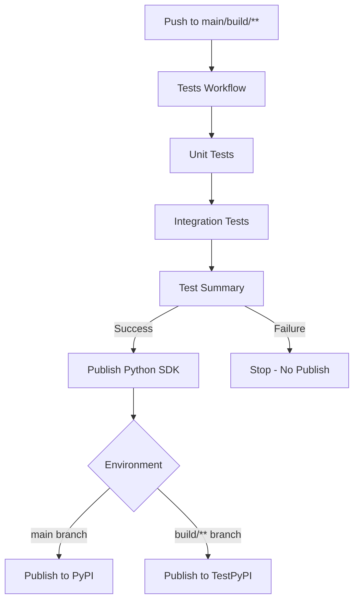

# GitHub Actions Workflows

This directory contains CI/CD workflows for the Pilot Protocol project.

## Workflow Overview



## Workflows

### 1. tests.yml (Tests)
**Triggers:** Push to `main`, `build/**`, `docs/**`, PRs to `main`

**Jobs:**
- **unit-tests**: Runs Go unit tests (`./tests/...`)
  - Generates coverage report
  - Uploads coverage artifact
  - Timeout: 5 minutes
  
- **integration-tests**: Runs Docker integration tests
  - Depends on: unit-tests
  - Runs CLI tests (21 tests)
  - Runs Python SDK tests (34 tests)
  - Timeout: 10 minutes
  
- **test-summary**: Aggregates results
  - Depends on: unit-tests, integration-tests
  - Fails if any test suite fails
  - Displays summary in GitHub UI

**Total Tests:** 55+ (Go unit tests + 21 CLI + 34 SDK integration tests)

### 2. publish-python-sdk.yml (Build and Publish Python SDK)
**Triggers:** 
- Manual workflow dispatch
- Automatic after "Tests" workflow completes (on `main` or `build/**`)

**Dependencies:**
- ⚠️ **Requires "Tests" workflow to pass** before publishing
- Will NOT publish if any tests fail

**Jobs:**
- **check-tests**: Validates test workflow passed
- **setup**: Determines environment (production vs test)
- **build-wheels**: Builds for Linux and macOS
- **publish**: Publishes to PyPI or TestPyPI
- **test-install**: Verifies installation works

**Behavior:**
- `main` branch → Production PyPI
- `build/**` branches → TestPyPI
- Manual dispatch → Choose environment

### 3. codeql.yml (Security Analysis)
**Triggers:** Push to `main`, PRs, weekly schedule

**Purpose:** Security scanning using GitHub CodeQL

## Cost Information

✅ **All workflows use FREE GitHub-hosted runners for public repos:**
- `ubuntu-latest`: FREE
- `macos-latest`: FREE

**Total Cost: $0/month**

## Testing Locally

```bash
# Run all tests
make test

# Run integration tests only
cd tests/integration && make test

# Run unit tests only
go test -v ./tests/...
```

## Workflow Dependencies

```
Tests Workflow (tests.yml)
    ↓
    ├─ Unit Tests (Go)
    ├─ Integration Tests (Docker: CLI + SDK)
    └─ Test Summary
         ↓
         └─ (on success) triggers →
              ↓
         Publish Python SDK (publish-python-sdk.yml)
              ↓
              ├─ Build Wheels
              ├─ Publish to PyPI/TestPyPI
              └─ Verify Installation
```

## Key Features

1. **Test-First Publishing**: SDK only publishes after ALL tests pass
2. **Multi-Platform**: Builds Linux and macOS wheels
3. **Coverage Reports**: Automatic coverage generation and artifact upload
4. **Environment Safety**: Test environment (TestPyPI) for `build/**` branches
5. **Comprehensive Testing**: Unit + Integration (CLI + SDK) tests
6. **Free Runners**: Zero cost for public repository
