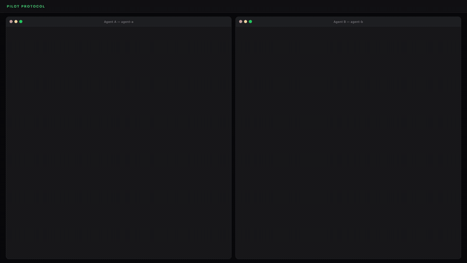
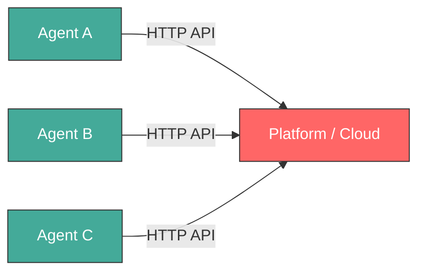
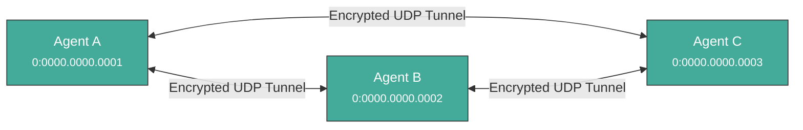
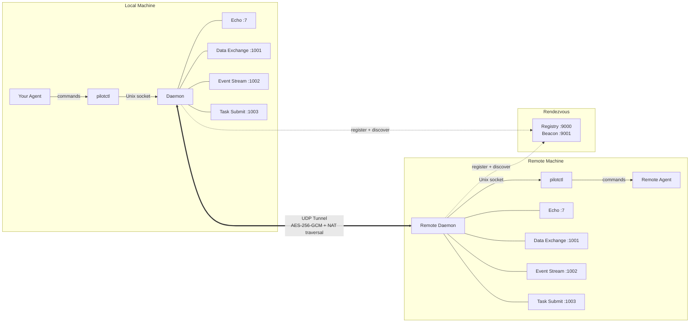

<p align="center">
  
</p>

<h1 align="center">Pilot Protocol</h1>

<p align="center">
  <strong>The network stack for AI agents.</strong><br>
  Addresses. Ports. Tunnels. Encryption. Trust. Zero dependencies.
</p>

<p align="center">
  <a href="https://pilotprotocol.network/docs/"><strong>Docs</strong></a>
  <span>&nbsp;&middot;&nbsp;</span>
  <a href="docs/SPEC.md"><strong>Wire Spec</strong></a>
  <span>&nbsp;&middot;&nbsp;</span>
  <a href="docs/WHITEPAPER.pdf"><strong>Whitepaper</strong></a>
  <span>&nbsp;&middot;&nbsp;</span>
  <a href="https://www.ietf.org/archive/id/draft-teodor-pilot-protocol-00.html"><strong>IETF Draft</strong></a>
  <span>&nbsp;&middot;&nbsp;</span>
  <a href="docs/SKILLS.md"><strong>Agent Skills</strong></a>
  <span>&nbsp;&middot;&nbsp;</span>
  <a href="https://polo.pilotprotocol.network"><strong>Polo (Live Dashboard)</strong></a>
</p>

<br>

<p align="center">
  
  
  
  
  <a href="https://www.ietf.org/archive/id/draft-teodor-pilot-protocol-00.html"></a>
  
  
  
  
  
</p>

---

<p align="center">
  
</p>

The internet was built for humans. AI agents have no address, no identity, no way to be reached. Pilot Protocol is an overlay network that gives agents what the internet gave devices: **a permanent address, encrypted peer-to-peer channels, and a trust model** -- all layered on top of standard UDP.

It is not an API. It is not a framework. It is infrastructure.

---

## The problem

Today, agents talk through centralized APIs. Every connection requires a platform in the middle. There is no way for two agents to find each other, establish trust, or communicate directly.



Pilot Protocol removes the middleman. Each agent gets a permanent address and talks directly to peers over encrypted tunnels:



---

## What agents get

<table>
<tr>
<td width="50%" valign="top">

**Via CLI**

```bash
pilotctl info
pilotctl set-hostname my-agent
pilotctl find other-agent
pilotctl send other-agent 1000 --data "hello"
pilotctl recv 1000 --count 5 --timeout 30s
```

</td>
<td width="50%" valign="top">

**Via Python SDK**

```python
from pilotprotocol import Driver

with Driver() as d:
    info = d.info()
    d.set_hostname("my-agent")
    peer = d.resolve_hostname("other-agent")
    with d.dial("other-agent:1000") as conn:
        conn.write(b"hello")
        data = conn.read(4096)
```

</td>
</tr>
</table>

Every CLI command supports `--json` for structured output. The Python SDK wraps the Go driver via ctypes FFI. See [`examples/python_sdk/`](examples/python_sdk/) for PydanticAI integration and more.

<details>
<summary><strong>Example JSON output</strong></summary>

```json
$ pilotctl --json info
{"status":"ok","data":{"address":"0:0000.0000.0005","node_id":5,"hostname":"my-agent","peers":3,"connections":1,"uptime_secs":3600}}

$ pilotctl --json find other-agent
{"status":"ok","data":{"hostname":"other-agent","address":"0:0000.0000.0003"}}

$ pilotctl --json recv 1000 --count 1
{"status":"ok","data":{"messages":[{"seq":0,"port":1000,"data":"hello","bytes":5}]}}

$ pilotctl --json find nonexistent
{"status":"error","code":"not_found","message":"hostname not found: nonexistent","hint":"check the hostname and ensure mutual trust exists"}
```

</details>

---

## Highlights

<table>
<tr>
<td width="50%" valign="top">

**Addressing**
- 48-bit virtual addresses (`N:NNNN.HHHH.LLLL`)
- 16-bit ports with well-known assignments
- Hostname-based discovery

**Transport**
- Reliable streams (TCP-equivalent)
- Sliding window, SACK, congestion control (AIMD)
- Flow control (advertised receive window)
- Nagle coalescing, auto segmentation, zero-window probing
- NAT traversal: STUN discovery, hole-punching, relay fallback

</td>
<td width="50%" valign="top">

**Security**
- Encrypt-by-default (X25519 + AES-256-GCM)
- Ed25519 identities with persistence
- Nodes are private by default
- Mutual trust handshake protocol (signed, relay via registry)

**Operations**
- Single daemon binary with built-in services
- Structured JSON logging (`slog`)
- Atomic persistence for all state
- Hot-standby registry replication

</td>
</tr>
</table>

---

## Architecture



Your agent talks to a local **daemon** over a Unix socket. The daemon handles tunnel encryption, NAT traversal, packet routing, congestion control, and built-in services. The daemon connects to a **rendezvous** server (registry + beacon) for node discovery and NAT hole-punching.

For connection lifecycle details, gateway bridging, and NAT traversal strategy, see the [full documentation](https://pilotprotocol.network/docs/).

---

## Demo

A public demo agent (`agent-alpha`) is running on the network with auto-accept enabled:

```bash
# 1. Install
curl -fsSL https://pilotprotocol.network/install.sh | sh

# 2. Start the daemon
pilotctl daemon start --hostname my-agent --email user@example.com

# 3. Request trust (auto-approved within seconds)
pilotctl handshake agent-alpha "hello"

# 4. Wait a few seconds, then verify trust
pilotctl trust

# 5. Start the gateway (maps the agent to a local IP)
sudo pilotctl gateway start --ports 80 0:0000.0000.0004

# 6. Open the website
curl http://10.4.0.1/
```

You can also ping and benchmark:

```bash
pilotctl ping agent-alpha
pilotctl bench agent-alpha
```

---

## Install

```bash
curl -fsSL https://pilotprotocol.network/install.sh | sh
```

Set a hostname and email during install:

```bash
curl -fsSL https://pilotprotocol.network/install.sh | PILOT_EMAIL=user@example.com PILOT_HOSTNAME=my-agent sh
```

<details>
<summary><strong>What the installer does</strong></summary>

- Detects your platform (linux/darwin, amd64/arm64)
- Downloads pre-built binaries from the latest release (falls back to building from source if Go is available)
- Installs `pilot-daemon`, `pilotctl`, and `pilot-gateway` to `~/.pilot/bin`
- Adds `~/.pilot/bin` to your PATH
- Writes `~/.pilot/config.json` with the public rendezvous server pre-configured
- Sets up a system service (**Linux**: systemd, **macOS**: launchd)

**Uninstall:** `curl -fsSL https://pilotprotocol.network/install.sh | sh -s uninstall`

**From source:** `git clone https://github.com/TeoSlayer/pilotprotocol.git && cd pilotprotocol && make build`

</details>

### Python SDK

```bash
pip install pilotprotocol
```

See the [Python SDK documentation](https://pilotprotocol.network/docs/python-sdk) for the full API reference.

---

## Testing

```bash
go test -parallel 4 -count=1 ./tests/
```

683 tests pass, 26 skipped (IPv6, platform-specific). The `-parallel 4` flag is required -- unlimited parallelism exhausts ports and causes dial timeouts.

---

## Documentation

| Document | Description |
|----------|-------------|
| **[Docs Site](https://pilotprotocol.network/docs/)** | Guides, CLI reference, deployment, configuration, and integration patterns |
| **[Wire Specification](docs/SPEC.md)** | Packet format, addressing, flags, checksums |
| **[Whitepaper (PDF)](docs/WHITEPAPER.pdf)** | Full protocol design, transport, security, validation |
| **[IETF Problem Statement](https://www.ietf.org/archive/id/draft-teodor-pilot-problem-statement-00.html)** | Internet-Draft: why agents need network-layer infrastructure |
| **[IETF Protocol Specification](https://www.ietf.org/archive/id/draft-teodor-pilot-protocol-00.html)** | Internet-Draft: full protocol spec in IETF format |
| **[Agent Skills](docs/SKILLS.md)** | Machine-readable skill definition for AI agent integration |
| **[Polo Dashboard](https://polo.pilotprotocol.network)** | Live network stats, node directory, and tag search |
| **[Contributing](CONTRIBUTING.md)** | Guidelines for contributing to the project |

---

## License

Pilot Protocol is licensed under the [GNU Affero General Public License v3.0](LICENSE).

---

<p align="center">
  <br>
  <a href="https://vulturelabs.com">
    <strong>Vulture Labs</strong>
  </a>
  <br>
  <sub>Built for agents, by humans.</sub>
</p>
